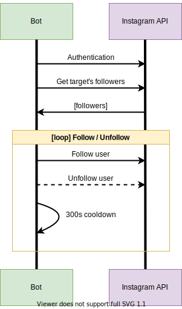

# Instagram Followers Bot

Hey, buddy! Whether you're having a hard time growing your **online business**, **business Instagram account**, or **personal Instagram account**, you've come to the **right place**. This tool will guarantee new followers daily, while allowing you to spend your time on more *important* matters, such as sleeping. After running the program, the bot will simultaneously follow and unfollow (*optional*) one account per 5 minutes. The five minute cooldown is in place to evade Instagram's *Action Blocked* error, which occurs when too many requests are made to Instagram's API too quickly.<br/>
The bot will request accounts that are following the specified ```target``` user, who can be a friend or a competitor, allowing you to widen your social circle, or steal clients from a business you're in competition with.

## Why request users?
The technique of requesting users is world renowned as the requested users are highly likely to check the account that requested to follow, or followed, them out. This leads to a spread of awareness of yourself, or your brand. Think of it as a *FollowForFollow* interaction. To mitigate the issue of eventually following an unprofessional amount of users, the bot allows for an automatic unfollowing of users at the same rate as it follows them.

## Requirements
- python3
- InstagramAPI (python3 module)

## How it works - Flowchart


# How To Use

## Variables
In the ```config.py``` file, the following variable can be found:<br/><br/>
```username```: Your Instagram account's username<br/>
```password```: Your Instagram account's password<br/>
```target```: The UserID of the Instagram account you will be harvesting users from. Find your target's userID at https://codeofaninja.com/tools/find-instagram-user-id<br/>
```unfollow```: Unfollow users too? If enabled, Random Instagram accounts will be unfollowed at the same rate as the bot follows accounts.<br/>
```unfollow_blacklist```: List of Instagram accounts not to unfollow if *unfollow = True*

## Run the bot
```$ python3 bot.py```

## FAQ
- How many followers can I expect to gain per day?
> **Answer:** The bot will request 288 Instagram accounts per 24h. If you keep the bot running 24/7, locally or off-site, a fair estimation would be about 85 new follows each day. This estimation is assuming that about 30% of the requested accounts will follow you back. However, this percentage is subject to heavy variation. Your followers-count may also be impacted by other factors, such as being unfollowed by users the bot unfollowed for you, assuming you opted in to unfollow users too.
- I'm getting Action Blocked errors by Instagram. What should I do?
> **Answer:** The bot's cooldown has been calculated to evade Instagram's request limit, however Instagram might have changed their limit once again. Wait up to a week before running the bot for the ban to lifted. If it still doesn't work, try changing the cooldown in ```bot.py``` and run the bot again. If the bot runs flawlessly with the updated request cooldown, please submit a pull request to be featured as a contributor!
